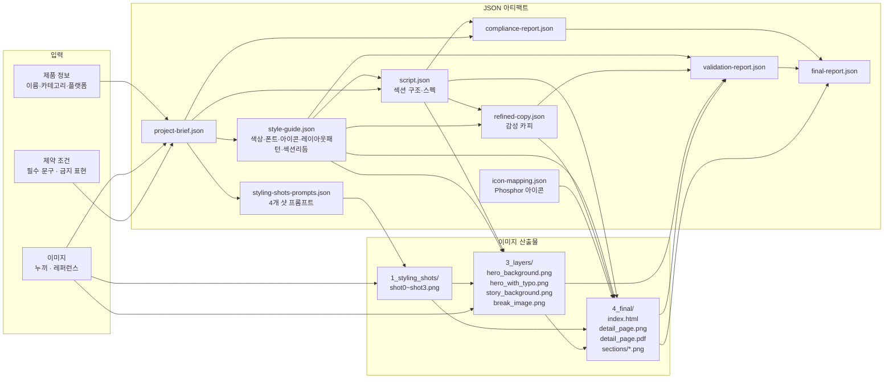

# DetailAI 파이프라인 구조

## 전체 흐름

```mermaid
flowchart TD
    INPUT([사용자 입력\n제품명 · 카테고리 · 플랫폼\n누끼 이미지 · 레퍼런스 이미지\n필수 문구 · 금지 표현])

    INPUT --> BRIEF

    subgraph PM["PM (오케스트레이터)"]

        BRIEF[Step 1\n프로젝트 브리프 생성\nproject-brief.json]

        BRIEF --> AD

        subgraph S2["Step 2"]
            AD[Art Director\nStyle Guide + Styling Prompts 생성\nClaude Sonnet]
            AD_VAL{PM 검증\n재료 노출 지시?\n금지 배경?}
            AD_FIX[자동 보정\npreservationRules 정화]
            AD --> AD_VAL
            AD_VAL -- 문제 있음 --> AD_FIX --> AD_OUT
            AD_VAL -- OK --> AD_OUT[style-guide.json\nstyling-shots-prompts.json]
        end

        AD_OUT --> SW

        subgraph S3["Step 3 (최대 2회 재실행)"]
            SW[Script Writer\n섹션 구조 · 스펙 · 키메시지\nClaude Sonnet]
            SW_VAL{PM 검증\n필수 문구 포함?\n금지 표현 없음?\n최소 5섹션?}
            SW_RETRY[Script Writer 재실행\n검증 실패 피드백 포함]
            SW --> SW_VAL
            SW_VAL -- 실패 최대 2회 --> SW_RETRY --> SW_VAL
            SW_VAL -- OK or 2회 초과 --> SW_OUT[script.json]
        end

        SW_OUT --> PAR

        subgraph S4["Step 4 (병렬)"]
            PAR(( ))
            SS[Styling Shots\n스타일링 사진 4장 생성\nGemini Pro Image\nshot0~shot3.png]
            CW[Copy Writer\n섹션별 감성 카피 정제\nClaude Sonnet\nrefined-copy.json]
            PAR --> SS & CW
        end

        SS --> LI
        CW --> LI_WAIT(( ))

        subgraph S5["Step 5"]
            LI[Layer Image\nGemini Pro Image]
            LI_1[1/4 hero_background.png]
            LI_2[2/4 hero_with_typo.png\nB방식: 별도 타이포 레이어]
            LI_3[3/4 story_background.png]
            LI_4[4/4 break_image.png\n시각 브레이크용 860×500]
            LI --> LI_1 & LI_2 & LI_3 & LI_4
        end

        LI_1 & LI_2 & LI_3 & LI_4 --> IM
        LI_WAIT --> IM

        subgraph S6["Step 6"]
            IM[Icon Mapper\nPhosphor 아이콘 매핑\n동기 실행 / 무비용\nicon-mapping.json]
        end

        IM --> HB

        subgraph S7["Step 7"]
            HB[HTML Builder\nClaude Sonnet]
            HB_PAT["layoutPatterns 읽기\n(Art Director 배정)"]
            HB_7PAT["7개 패턴 렌더링\nfull-bleed-hero\nleft/right-image-text\nfull-bleed-sensory\ndark-story-centered\nnumbered-steps-horizontal\ngrid-info-cards"]
            HB --> HB_PAT --> HB_7PAT --> HB_OUT[index.html]
        end

        HB_OUT --> QA_LOOP

        subgraph S8["Step 8 — QA 루프 (최대 3회)"]
            QA_LOOP[QA Agent\n법적 금지표현 · 필수 문구 · 플랫폼 규정\nClaude Haiku]
            QA_DEC{PASS?}
            QA_WHO{CRITICAL 원인}
            RE_SW[Script Writer 재실행\n→ Copy Writer → HTML 재빌드]
            RE_CW[Copy Writer 재실행\n→ HTML 재빌드]
            QA_LOOP --> QA_DEC
            QA_DEC -- FAIL --> QA_WHO
            QA_WHO -- required_content\nlegal --> RE_SW --> QA_LOOP
            QA_WHO -- restriction\n기타 --> RE_CW --> QA_LOOP
            QA_DEC -- PASS --> VAL
        end

        subgraph S9["Step 9 — Validator (QA PASS 후)"]
            VAL[Validator\nStyle Guide 통일성 검증\nClaude Sonnet]
            VAL_DEC{PASS?\n모든 점수 ≥3\n이모지 없음\nCRITICAL 없음}
            VAL_FAIL[Copy Writer 재실행\n→ HTML 재빌드]
            VAL --> VAL_DEC
            VAL_DEC -- FAIL --> VAL_FAIL --> QA_LOOP
            VAL_DEC -- PASS --> PW
        end

        subgraph S10["Step 10 — Playwright 캡처 (PASS 시만)"]
            PW[Playwright\n@sparticuz/chromium-min]
            PW_1[detail_page.png\n전체 페이지 · 2x 레티나\n860px × fullPage]
            PW_2[sections/section_NN.png\n섹션별 PNG · 플랫폼 업로드용]
            PW_3[detail_page.pdf\n860px 너비]
            PW --> PW_1 & PW_2 & PW_3
        end

    end

    PW_1 & PW_2 & PW_3 --> OUT
    OUT([최종 산출물\nfinal-report.json])
```

---

## 입출력 데이터 흐름



---

## 에이전트별 모델 · 비용 요약

| Step | 에이전트 | 모델 | 호출 방식 | 비용 규모 |
|------|---------|------|---------|---------|
| 2 | Art Director | Claude Sonnet | 1회 (재실행 없음) | 중 |
| 3 | Script Writer | Claude Sonnet | 1~3회 (PM 검증 재실행) | 중 |
| 4a | Styling Shots | Gemini Pro Image | 4장 병렬 | **고** (이미지 생성) |
| 4b | Copy Writer | Claude Sonnet | 1~3회 (QA 실패 시) | 중 |
| 5 | Layer Image | Gemini Pro Image | 4장 순차 | **고** (이미지 생성) |
| 6 | Icon Mapper | 없음 (규칙 기반) | 동기 | 무료 |
| 7 | HTML Builder | Claude Sonnet | 1~3회 (재빌드 시) | 중 |
| 8 | QA | Claude Haiku | 1~3회 | 저 |
| 9 | Validator | Claude Sonnet | 1~3회 | 중 |
| 10 | Playwright | 없음 (브라우저) | 1회 | 무료 |

> 이미지 생성(Step 4a + 5)이 전체 시간의 70~80%를 차지합니다.  
> Styling Shots(4장) + Layer Image(4장) = 총 8장 생성.

---

## PM 자동 보정 로직

```
Art Director 결과 → PM 검증
  재료 노출 지시 발견 (필링/단면 + 보여/추가) → productPreservationRules에서 제거
  금지 배경 발견 (카페/주방/야외) → 경고만 출력 (현재)
  → 보정 후 styling-shots-prompts.json 재저장

Script Writer 결과 → PM 검증  
  필수 문구 누락 → Script Writer 재실행 (최대 2회)
  금지 표현 사용 → Script Writer 재실행
  섹션 5개 미만 → Script Writer 재실행
  → 재실행 시 검증 실패 피드백 프롬프트에 포함

QA FAIL → 원인별 분기
  CRITICAL + required_content/legal → Script Writer부터 재실행
  CRITICAL + restriction/기타 → Copy Writer만 재실행
  → 재실행 후 Copy Writer → Icon Mapper → HTML Builder 순으로 재빌드
```

---

## 디렉토리 구조

```
output/{projectId}/
├── project-brief.json
├── style-guide.json
├── styling-shots-prompts.json
├── script/
│   └── script.json
├── 1_styling_shots/
│   ├── shot0.png  (left-image 섹션용)
│   ├── shot1.png
│   ├── shot2.png
│   └── shot3.png
├── 3_layers/
│   ├── hero_background.png   (히어로 배경)
│   ├── hero_with_typo.png    (히어로 + 타이포)
│   ├── story_background.png  (브랜드 스토리 배경)
│   └── break_image.png       (시각 브레이크 860×500)
├── 4_icons/
│   └── icon-mapping.json
├── 4_final/
│   ├── index.html
│   ├── detail_page.png       (2x 레티나 전체)
│   ├── detail_page.pdf
│   └── sections/
│       ├── section_01.png    (섹션별 · 플랫폼 업로드용)
│       └── section_NN.png
├── refined-copy.json
├── compliance-report.json
├── validation-report.json
└── final-report.json
```
